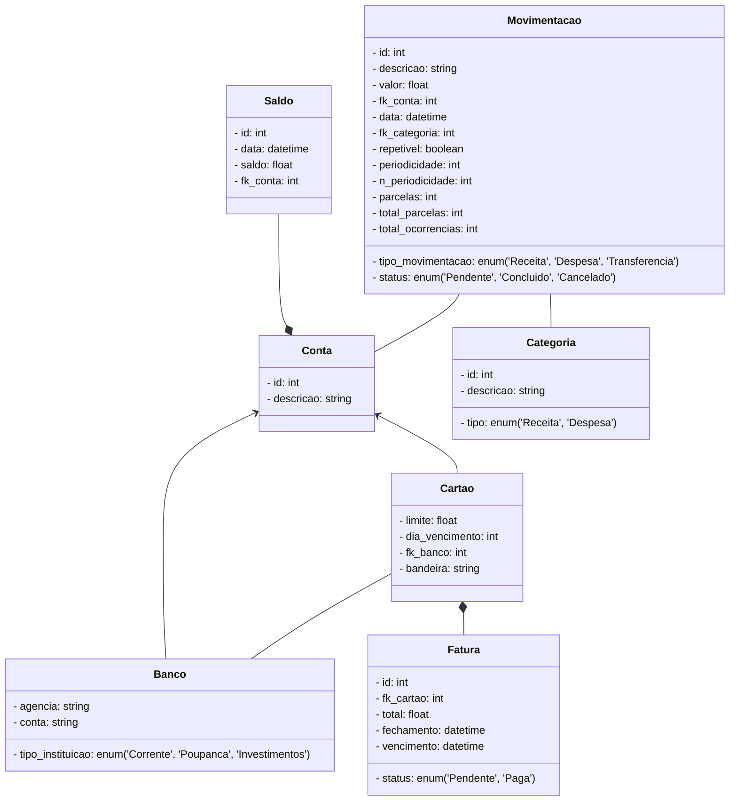

```mermaid
classDiagram
    Conta <-- Banco
    Conta <-- Cartao

    Cartao -- Banco
    Cartao *-- Fatura

    Saldo --* Conta

    Movimentacao -- Categoria
    Movimentacao -- Conta

    class Conta{
        - id: int
        - descricao: string
    }

    class Banco{
        - tipo_instituicao: enum ('Corrente', 'Poupanca', 'Investimentos')
        - agencia: string
        - conta: string
    }

    class Saldo{
        - id: int
        - data: datetime
        - saldo: float
        - fk_conta: int
    }

    class Cartao{
        - limite: float
        - dia_vencimento: int
        - fk_banco: int
        - bandeira: string
    }

    class Categoria{
        - id: int
        - descricao: string
        - tipo: enum ('Receita', 'Despesa')
    }

    class Movimentacao{
        - id: int
        - descricao: string
        - valor: float
        - fk_conta: int
        - data: datetime
        - fk_categoria: int
        - repetivel: boolean
        - periodicidade: int
        - n_periodicidade: int
        - parcelas: int
        - total_parcelas: int
        - total_ocorrencias: int
        - tipo_movimentacao: enum ('Receita', 'Despesa', 'Transferencia')
        - status: enum ('Pendente', 'Concluido', 'Cancelado')
    }

    class Fatura{
        - id: int
        - fk_cartao: int
        - total: float
        - fechamento: datetime
        - vencimento: datetime
        - status: enum ('Pendente', 'Paga')
    }
```
